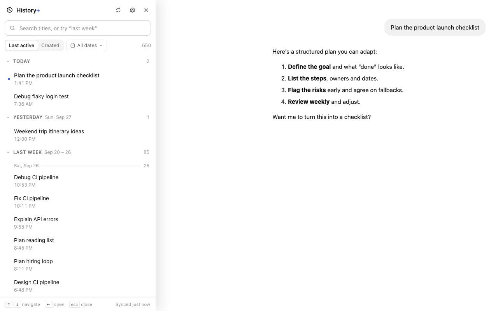
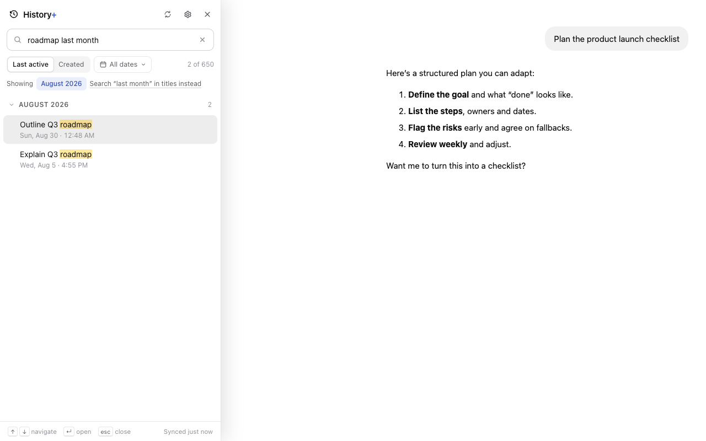
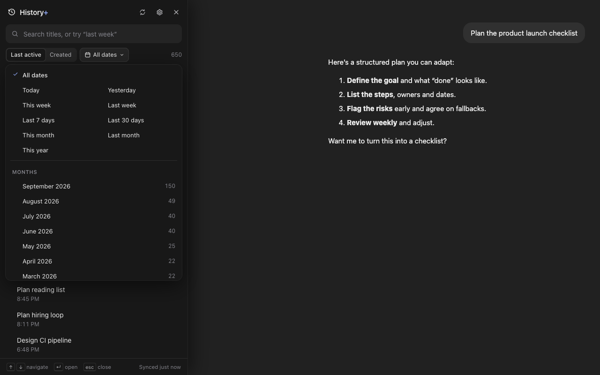
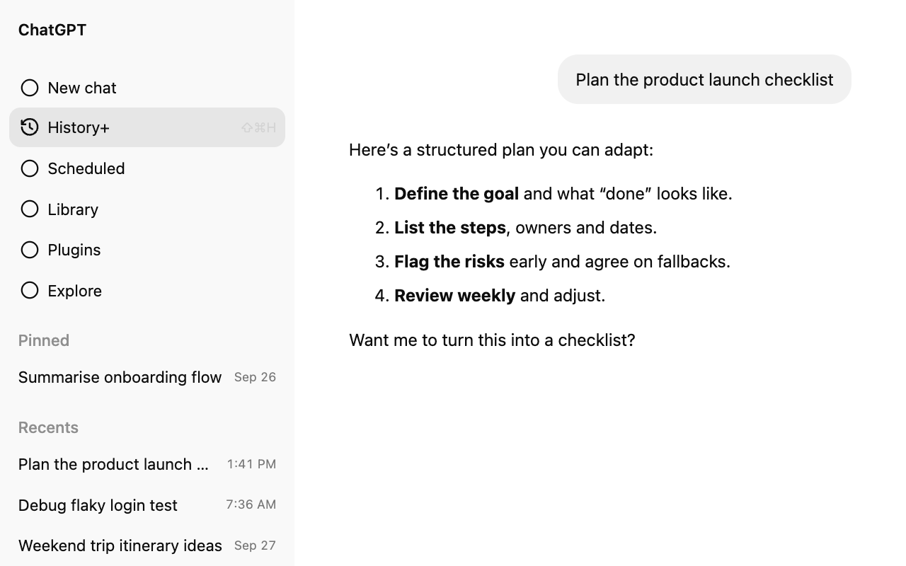

<p align="center">
  
</p>

<h1 align="center">History+ for ChatGPT</h1>

<p align="center">
  <strong>Your ChatGPT timeline.</strong> Find any old conversation by <em>when</em> it happened.<br>
  Local-only · No account · No tracking
</p>

<p align="center">
  <a href="#install">Install</a> ·
  <a href="PRIVACY.md">Privacy</a> ·
  <a href="https://github.com/libinvbabu/chatgpt-history-plus/issues">Report an issue</a>
</p>



## Why

You remember discussing something *around the third week of August*, but not what the chat was called. ChatGPT's sidebar only keeps recent chats close at hand, and its search needs the right words.

History+ adds the missing piece, **time**:

```
⇧⌘H  →  August 2026  →  Aug 17 – 23  →  scan 10–20 titles  →  click
```

## Features

- **Your whole history, by date.** Today, Yesterday, Earlier this week, Last week, then months and years. Big weeks get day dividers and big months get week dividers. Groups collapse and remember it.
- **Dates in ChatGPT's own sidebar.** A small date appears beside every conversation ChatGPT lists.
- **Instant search that understands dates.** Try `roadmap last month`, `around sep 14`, `invoice in:aug` or `created:2026-07`. Search covers titles only, never needs the network, and handles 10,000+ chats easily.
- **Last active or Created.** Switch which date drives the timeline; hover a row to see both.
- **Keyboard-first.** `⇧⌘H` / `Ctrl+Shift+H` opens it. Then `↑` `↓` to move, `↵` to open, `⌘↵` for a new tab, `/` to search, `esc` to close.
- **Stays out of the way.** The panel sits beside the chat, so you can click through candidates without losing your place.
- **Works with personal and Team/Business workspaces**, each with its own separate cache. Light and dark themes follow ChatGPT.

| Search that reads dates | Dark mode and the date menu | Built into ChatGPT's sidebar |
|---|---|---|
|  |  |  |

## Privacy

History+ reads **conversation titles, ids and timestamps** from chatgpt.com, the same list ChatGPT's own sidebar loads, and keeps them in your browser's extension storage.

- **No message content** is ever read.
- **Nothing leaves your device.** There are no servers, analytics or third parties; the only requests go to chatgpt.com.
- **Your session token** is held in memory for one sync and never stored.
- **Permissions:** just `storage` and access to `chatgpt.com`.
- **Removal:** delete everything any time with Settings → *Clear local data*, or by uninstalling.

Read the full [privacy policy](PRIVACY.md).

## Install

**Chrome Web Store:** coming soon.

**From source** (Chrome, Edge, Arc, Brave, or any Chromium browser):

```bash
git clone https://github.com/libinvbabu/chatgpt-history-plus.git
```

```bash
cd chatgpt-history-plus && npm install && npm run build
```

Then open `chrome://extensions` (or `arc://extensions`), enable **Developer mode**, click **Load unpacked**, and choose the `dist/` folder.

Open [chatgpt.com](https://chatgpt.com) and use any of these to open History+:
- the **History+** item in the sidebar
- **⇧⌘H** / **Ctrl+Shift+H**
- the toolbar icon

## Search cheat-sheet

| You type | You get |
|---|---|
| `invoice` | titles containing "invoice" (all words must match; case, accents and punctuation are ignored) |
| `last week` · `yesterday` · `aug 2026` · `sep 23` · `2025` | everything from that period |
| `around sep 14` · `mid aug` · `aug 17-23` · `week of aug 19` · `tuesday` | fuzzy periods and ranges |
| `roadmap last month` · `invoice in aug` · `budget since sep 10` | title words plus a period |
| `after:2026-08-01` · `before:sep-20` · `in:sep` · `on:2026-09-23` | operators |
| `created:2026-07` · `updated:last-week` · `year:2025 month:dec` | a specific date field |
| `"march madness"` | quoted text is always a literal title search |

When History+ reads a date from your search, it says so (e.g. *Showing August 2026*) and offers to search the words as a title instead.

## FAQ

**Does it read my conversations?** No. Only titles, ids and timestamps: what ChatGPT's own sidebar already shows.

**Why is the first sync slow?** ChatGPT limits how fast its conversation list can be read, and its own sidebar shares that allowance. History+ paces itself, waits when asked, and resumes by itself. You can browse while it catches up.

**The History+ item disappeared from ChatGPT's sidebar.** ChatGPT probably changed its layout. `⇧⌘H` and the toolbar icon still work. Please [open an issue](https://github.com/libinvbabu/chatgpt-history-plus/issues) and include Settings → **Copy diagnostics**, which contains no titles or ids.

**Is this made by OpenAI?** No. History+ is an independent open-source project, not affiliated with or endorsed by OpenAI. ChatGPT is a trademark of OpenAI.

## Development

See [docs/DEVELOPMENT.md](docs/DEVELOPMENT.md) for the architecture, design decisions, tests (80 unit and 16 end-to-end in real Chromium), and the release process.

## License

[MIT](LICENSE) © Libin V Babu
